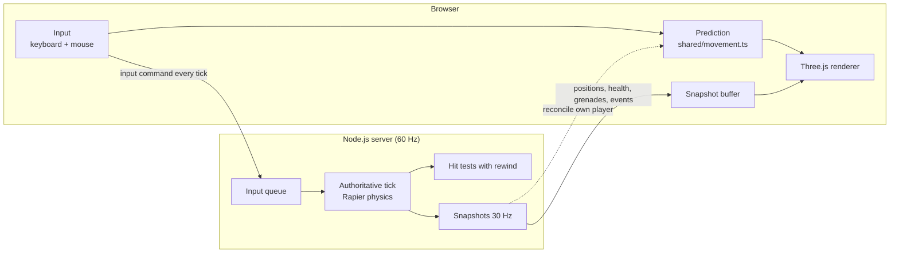

# Headshot

A fast 3D first-person deathmatch that runs in the browser. Open a link and you're playing: no installs, no accounts, no loading screen.

Inspired by [deadshot.io](https://deadshot.io), Headshot is built to download quickly, load instantly and run smoothly on weak laptops. For now it's played over a local network. It's built to go public later, so the server checks every move and hit, and players still feel no lag.

---

## Contents

- [Quick start](#quick-start)
- [Playing on your local network](#playing-on-your-local-network)
- [How to play](#how-to-play)
- [How it works](#how-it-works)
- [Project layout](#project-layout)
- [Development](#development)
- [Tuning the game](#tuning-the-game)
- [Performance budgets](#performance-budgets)
- [Status and roadmap](#status-and-roadmap)

---

## Quick start

You need **Node.js 22.18 or newer**. Node runs the TypeScript server directly, so the server has no build step.

```bash
npm install
npm run dev
```

Then open **http://localhost:3000** in a browser, type a name and click in to play. Open a second tab to fight yourself.

To run it without watch mode:

```bash
npm run build   # bundle the client into dist/
npm start       # serve whatever the last build produced
```

## Playing on your local network

When the server starts, it prints every address it can be reached at:

```
Headshot server running
  On this PC:       http://localhost:3000
  On your network:  http://192.168.1.42:3000
```

Other people on the same Wi-Fi or LAN open the **"On your network"** address. Up to 8 players can join a match.

> **Can't connect from another PC?** Windows Firewall probably blocked Node. Allow Node.js on private networks when Windows asks, or add an inbound rule for TCP port 3000.

Set the `PORT` environment variable to use a different port.

## How to play

### Controls

| Key | Action |
|---|---|
| <kbd>W</kbd> <kbd>A</kbd> <kbd>S</kbd> <kbd>D</kbd> | Move |
| Mouse | Look (click the game to lock the pointer) |
| <kbd>Space</kbd> | Jump |
| Left click | Shoot |
| <kbd>G</kbd> | Throw a grenade |
| Hold <kbd>Tab</kbd> | Scoreboard |
| <kbd>Esc</kbd> | Release the mouse |

### Rules

- **Health:** everyone has 100 HP.
- **Rifle:** hits instantly. A body shot does 25 damage. A headshot kills in one hit.
- **Grenades:** 2 per life. They bounce around and explode after 3 seconds. Damage and knockback get weaker with distance, and walls block them.
- **Death:** your body goes limp as a ragdoll, and you respawn after 3 seconds at a spawn point away from living enemies.
- **Winning:** the first player to **15 kills** wins. The scoreboard stays up for 10 seconds, then a new match starts.

The arena is about 40 × 40 m, with cover, ramps and a raised platform.

---

## How it works

Most of the interesting code is the netcode. The goal: the **server has the final say** on everything (so nobody can cheat by editing the client), while each player **still feels instant** response to their own input.

### The big picture



### 1. One codebase for browser and server

Movement, hit tests, protocol and the arena all live in `src/shared/` and run **identically** on both sides. That's what makes prediction work: when the browser guesses where you'll be, it runs the exact same code the server will run.

Physics uses [Rapier](https://rapier.rs), which compiles to WebAssembly and behaves the same in Node and the browser.

### 2. The server is in charge

The server simulates the game at a fixed **60 ticks per second** and sends a snapshot of the world **30 times per second**.

Every tick, each client sends one small input command:

```ts
{ seq, buttons, yaw, pitch, viewTick }
```

The server applies **exactly one command per player per tick**. Extra commands wait in a short queue, and if none has arrived the last one is repeated. So a modified client can't move faster by sending commands faster.

Fire rate, damage, grenade count and respawns are all decided on the server. The client only draws the result.

### 3. Prediction: your own movement feels instant

Waiting for the server before moving would feel like wading through mud. Instead, the browser:

1. **Predicts:** runs your input through `shared/movement.ts` immediately and draws the result.
2. **Remembers:** keeps every command the server hasn't confirmed yet.
3. **Reconciles:** when a snapshot arrives, it snaps back to the server's position, replays the unconfirmed commands on top, and smoothly blends away any small difference over a few frames.

Mouse look is applied every frame, so aiming is never delayed.

### 4. Interpolation: other players move smoothly

Snapshots arrive 30 times a second, and never at perfectly even intervals. Other players are drawn **100 ms in the past**, gliding between two buffered snapshots. That hides network jitter completely, at the cost of seeing others slightly behind where they really are.

### 5. Lag compensation: if it was on your crosshair, it hits

Because other players are drawn in the past, shooting where you *see* someone would miss where they *are*. The server fixes that:

1. It keeps about **1 second of position history** for every player.
2. Each input command says which tick the shooter was looking at (`viewTick`).
3. When you fire, the server **rewinds** everyone else to that moment (at most 250 ms back) and tests the shot against their **head sphere** and **body capsule**.
4. A raycast against the arena checks that no wall was in the way.

### 6. Grenades, explosions and ragdolls

- **Grenades** are real Rapier rigid bodies, but only on the server. Clients draw them from snapshots.
- **Explosions** are resolved on the server: damage falls off with distance, needs line of sight, and pushes players back by changing their velocity (which prediction then picks up).
- **Ragdolls** are purely cosmetic. Each browser simulates its own in a local Rapier world, and they're never sent over the network.

### 7. Everything from the client is untrusted

- `shared/protocol.ts` checks every field of every message (type, finite numbers, ranges, lengths) and rejects anything invalid. A malformed message closes that connection.
- Message size is capped, and each connection has a message-rate limit.
- Player names are limited to 16 characters with control characters removed, and are shown with `textContent`, never as HTML.
- The static file server rejects any path outside `public/` and `dist/`.
- An error on one connection closes that connection, never the whole server.

---

## Project layout

```
public/
  index.html          page shell, menu, HUD markup
build.ts              esbuild: production bundle, or watch + server with --dev
src/
  shared/             runs in the browser AND on the server
    constants.ts      every tunable number
    math.ts           clamp, lerp, angle wrapping, rounding
    protocol.ts       message types, encode/decode, validation
    world.ts          the arena: boxes, ramps, spawn points, Rapier colliders
    movement.ts       player movement (Rapier character controller)
    combat.ts         hit tests, damage, explosion falloff, rewind history
  server/             Node only
    main.ts           HTTP + WebSocket server, connection limits, tick loop, fake lag
    static-files.ts   safe path resolution for public/ and dist/
    match.ts          the authoritative tick: inputs, shots, grenades, respawns, scores, snapshots
  client/             browser only
    main.ts           boot: Rapier init, connect, main loop
    net.ts            socket, prediction, reconciliation, snapshot buffer, interpolation
    input.ts          pointer lock, keyboard and mouse → input commands
    render.ts         Three.js scene, box-people characters, grenades, effects
    ragdoll.ts        local-only ragdolls
    hud.ts            health, scoreboard, kill feed
dist/                 build output (generated, not committed)
```

**Import rules:** `shared/` never imports from `client/` or `server/` and uses no DOM, Node APIs or Three.js. The server never imports Three.js. The client never imports Node APIs.

### Tech stack

| Part | Choice |
|---|---|
| 3D graphics | [Three.js](https://threejs.org) |
| Physics | [Rapier](https://rapier.rs) (`@dimforge/rapier3d-compat`), in the browser and on the server |
| Server | Node.js 22 + [`ws`](https://github.com/websockets/ws) |
| Language | TypeScript, for type checking only |
| Client bundle | [esbuild](https://esbuild.github.io): one minified file |
| Format and lint | [Biome](https://biomejs.dev) |
| Tests | Node's built-in `node --test` |

Only three runtime dependencies. New ones need a good reason.

---

## Development

### Commands

| Command | What it does |
|---|---|
| `npm run dev` | Builds the client in watch mode and starts the server. Restarts when server code changes. |
| `npm run build` | Builds the minified production bundle into `dist/` and checks it against the load budget. |
| `npm start` | Runs the server using the last build. |
| `npm run check` | Type check, Biome lint and format check, and all tests. Run before every commit. |
| `npm test` | Tests only. |
| `npm run format` | Auto-fixes formatting and safe lint issues. |

### Testing with fake lag

Netcode that feels fine on `localhost` can fall apart on a real connection. The server can simulate one by delaying every message it sends and receives:

```powershell
# PowerShell
$env:LAG_MS=150; $env:JITTER_MS=30; npm run dev
```

```bash
# bash / zsh
LAG_MS=150 JITTER_MS=30 npm run dev
```

`LAG_MS` adds a fixed delay each way. `JITTER_MS` adds a random extra delay on top, without ever reordering messages (real TCP doesn't either).

Open two tabs and check that there's no rubber-banding, jitter, or shots that visibly hit but don't count.

### Tests

Tests sit next to the code they test as `*.test.ts`, using `node:test` and `node:assert/strict`:

- `movement.test.ts`: walking, walls, jumping, steps, ramps, and replaying inputs giving the same result
- `protocol.test.ts`: encode/decode round trips, rejecting malformed messages, cleaning names
- `combat.test.ts`: ray tests against spheres and capsules, explosion falloff, rewind history
- `match.test.ts`: body shots and headshots, lag compensation, walls blocking shots, fire rate, grenades, winning, the input queue, spawn choice
- `static-files.test.ts`: serving files and rejecting paths that escape the served folders

Mouse and keyboard input need pointer lock, which doesn't work in headless browsers, so check those by hand.

### Code style in a nutshell

- Game state is **plain typed data**. Logic is functions that take that state. No classes of our own.
- State never holds Three.js objects. The renderer keeps its own views and syncs them from state each frame.
- The server has no module-level game state, so one process could run many matches later.
- **No allocations in hot paths** (render loop, tick, movement, hit tests). Scratch objects are reused so garbage collection never causes stutter.
- Rapier objects live in WebAssembly memory and are freed explicitly.
- No `any`, no `!` non-null assertions, no `enum`.

[`CLAUDE.md`](CLAUDE.md) has the full set of rules and design decisions.

---

## Tuning the game

Every gameplay number lives in **[`src/shared/constants.ts`](src/shared/constants.ts)**: movement speed, gravity, jump height, damage, fire rate, grenade fuse and blast radius, kills to win, tick rate, interpolation delay, and more.

Change a value there and it applies to both the server and the client, so prediction stays in sync. A few favourites:

| Constant | Default | Meaning |
|---|---|---|
| `WALK_SPEED` | `6` | metres per second |
| `JUMP_SPEED` | `6.5` | initial upward speed of a jump |
| `BODY_DAMAGE` | `25` | damage per body shot |
| `FIRE_INTERVAL_TICKS` | `8` | ticks between shots (7.5 shots per second) |
| `GRENADES_PER_LIFE` | `2` | grenades you spawn with |
| `EXPLOSION_RADIUS` | `6` | metres |
| `KILLS_TO_WIN` | `15` | kills to end the match |
| `INTERP_DELAY_TICKS` | `6` | how far in the past other players are drawn (100 ms) |

---

## Performance budgets

Headshot should play well on a cheap laptop over an ordinary connection.

| What | Budget |
|---|---|
| Download | ≤ 3 MB compressed until playable, and playable within 3 s |
| Client | Steady 60 fps at 1080p on Intel UHD integrated graphics |
| Server | One tick ≤ 2 ms with 8 players |

`npm run build` prints the gzipped bundle size and fails if it's over budget. While players are connected, the server logs its average and worst tick time every 30 seconds and flags any tick over 2 ms.

To keep those numbers:

- No real-time shadows and no post-processing. Lighting is one hemisphere light plus one directional light.
- Pixel ratio is capped at 2.
- Characters are simple box people built in code, so there's nothing to download.
- Effects like tracers and explosions reuse objects instead of creating new ones per shot.
- The HUD only touches the DOM when a value actually changes.

---

## Status and roadmap

**Built (as of September 2026):**

- [x] Walking around a code-built arena with mouse look
- [x] Server-checked movement with prediction, reconciliation and interpolation
- [x] Lag-compensated rifle, head and body damage, death and respawn
- [x] Box-people characters with a walk cycle, and ragdolls on death
- [x] Server-simulated grenades with falloff damage and knockback
- [x] Name entry, scoreboard, kill feed, first to 15 wins

**Next:**

- [ ] A real map made in Blender with baked lighting, exported as compressed `.glb`
- [ ] A local-network playtest on several PCs

**Before going public:**

- [ ] Binary inputs and snapshots instead of JSON (aiming for ≤ 10 KB/s per player)
- [ ] Rooms and matchmaking
- [ ] Hosting behind Cloudflare with `wss://` and compressed, long-cached assets
- [ ] `Origin` header check on WebSocket connections and per-IP connection limits
